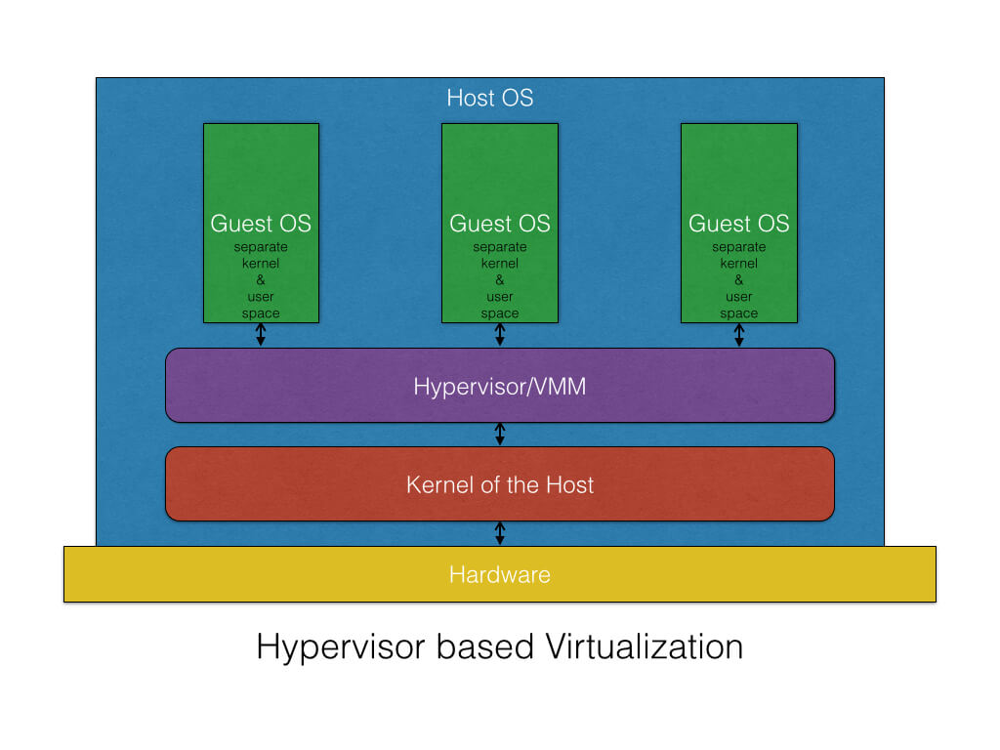
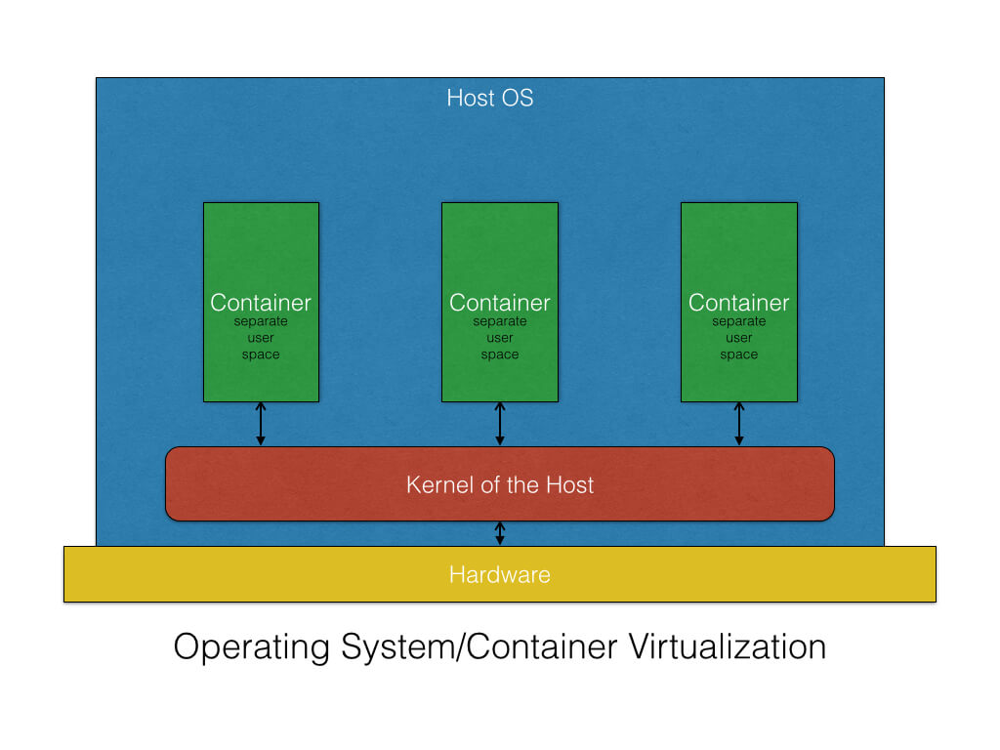
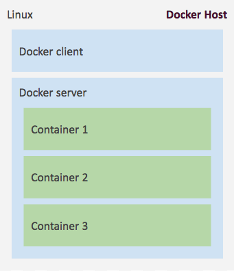
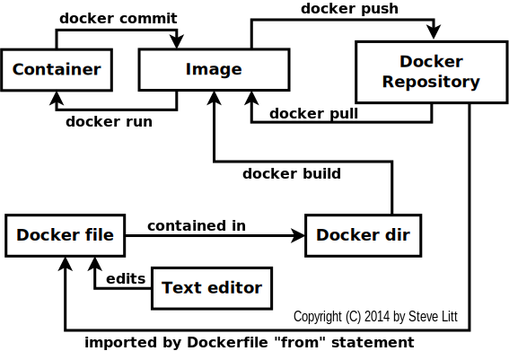

# Part1 - Czym jest Docker?
Docker to mechanizm bardzo lekkiej wirtualizacji dla Linuksa. Uruchamiane pod jego kontrolą kontenery korzystają z systemowego jądra, ale poza tym są odizolowane od macierzystego systemu, więc zachowują się jak oddzielne wirtualki, choć nie korzystają z translacji kodu, więc działają z pełną prędkością, a narzut pamięci jest niewielki. Kontener może używać zupełnie innej dystrybucji, ponieważ punktem wspólnym jest jedynie jądro.

| Maszyny wirtualne | Docker |
|-|-|
|  | |
<!-- | |  | -->

## Pojęcia:
 * Image - przygotowany 'skompilowany' obraz kontenera
 * Container - działajacy kontener dockerowy z uruchomionym obrazem
 * docker-server - środowisko gdzie są uruchamiane kontenery
 * docker-client - polecenie terminala, z którego możemy uruchamiać kontenery, budować obrazy
 * Dockerfile - plik definiujący jak zbudować obraz Dockerowy

## Ciekawostki

## Ciekawe miejsca
 * [Wiki in4mates - jak zainstalować Dockera na ubuntu ](https://redmine.in4mates.com/projects/in4mates/wiki/Docker)
 * [Zagubiony poradnik do Dockera - głównie dla Mac OS X ale polecam każdemu](https://viget.com/extend/how-to-use-docker-on-os-x-the-missing-guide)
 * [Top 15 pytań o Dockera na StackOverflow](http://stackoverflow.com/questions/tagged/docker?sort=votes&pageSize=15)
 * [Top 15 pytań o Dockera na ServerFault](http://serverfault.com/questions/tagged/docker?sort=votes&pageSize=15)
