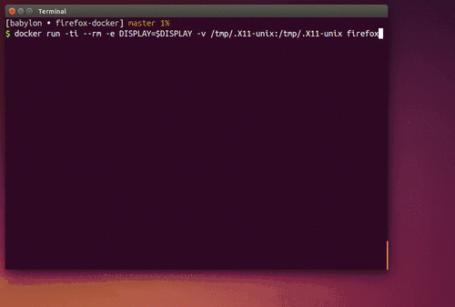

# Aplikacje GUI w Dockerze
Źródła:
 * [Blog post Fábio Rehm](http://fabiorehm.com/blog/2014/09/11/running-gui-apps-with-docker/)
 * [NetBeans na DockerHubie](https://hub.docker.com/r/fgrehm/netbeans/)
 * [NetBeans na GitHubie](https://github.com/fgrehm/docker-netbeans)


## Firefox
Zbuduj:
```
docker build -t firefox firefox/
```
Uruchom:
```
docker run -ti --rm \
       -e DISPLAY=$DISPLAY \
       -v /tmp/.X11-unix:/tmp/.X11-unix \
       firefox
```

Efekt:



## NetBeans


